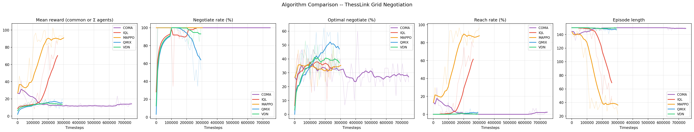
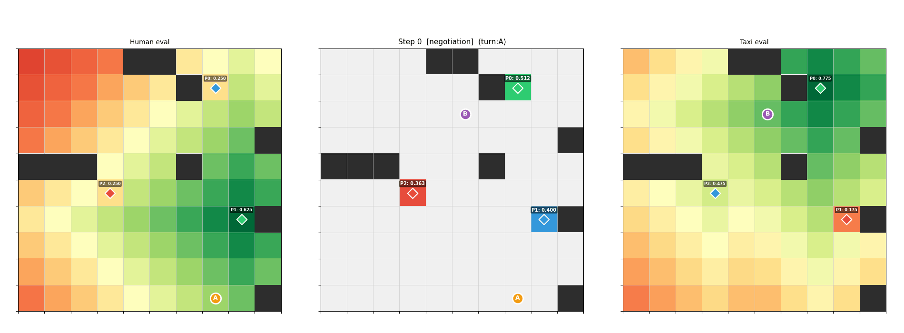

# ThessLink RL -- Multi-Agent Grid Negotiation for EPyMARL

Multi-Agent Reinforcement Learning environment where two agents **negotiate** over Points of Interest (POIs) on a 10x10 grid, then **navigate** to the agreed target. Both phases are **RL-trained** -- agents learn to negotiate through suggest/accept actions and to navigate with movement actions. Designed to plug into [EPyMARL](https://github.com/uoe-agents/epymarl) for training with algorithms like QMIX, MAPPO, VDN, IQL, and more.

## The task (in short)

Two agents start at random cells on a small map with obstacles and three candidate meeting spots (POIs). Each agent **likes** some POIs more than others: cheaper to reach (energy) and/or harder to infer where they came from (privacy), according to YAML “agent models.” They must **agree on one POI**, then **both reach it**. The episode succeeds only when everyone arrives at the chosen POI (in v1/v2, the first agent to arrive waits; negotiation rules differ by version).

## Environment versions

| Version | Gym id | Observation | Notes |
|--------|--------|-------------|--------|
| **v0** | `thesslink/GridNegotiation-v0` | 311-d flat grid (CNN-friendly) | Simultaneous “suggest POI” each step; agreement when both pick the same POI on the same step. |
| **v1** | `thesslink/GridNegotiation-v1` | 19-d symbolic | Turn-based suggest / accept; cooperative meeting; GPS + lidar, no full grid in the vector. |
| **v2** | `thesslink/GridNegotiation-v2` | Same 19-d as v1 | Same dynamics as v1 **plus** shaped rewards in the gym wrapper (negotiation hints, potential-based navigation, scaled bonuses). |

The active version for local scripts (`visualize.py`, `train.sh`, etc.) is set in `config.py` as `ENV_VERSION` (default **2**). EPyMARL runs should use the matching env config, e.g. `thesslink_v2` for v2.

## Evaluation: POI scores (module-based)

Preference scores come from `thesslink_rl/evaluation.py` and the agent YAML (`energy_model`, `privacy_emphasis`, etc.):

1. **Energy** — BFS shortest-path distance from the agent’s **current** cell to each POI is turned into a cost using either a **linear** or **exponential** step-cost model (`energy_model`, `energy_exponential_gamma`). Lower cost is better.
2. **Privacy** — BFS distance from the agent’s **spawn** cell to each POI: farther from spawn is treated as more private.
3. **Normalisation** — For each agent, energy and privacy values across the three POIs are **min–max normalised** to \([0, 1]\) so they are comparable before mixing.
4. **Blend** — Per POI, the score is a convex mix:  
   `score = (1 - p) * energy_norm + p * privacy_norm`  
   where `p = privacy_emphasis` in \([0, 1]\).

For **negotiation quality** (how good the agreed POI is for *both* agents), the code uses a **golden mean** over POIs: multiply each agent’s three POI scores pointwise, then compare the chosen POI’s product to the best possible product. That ratio (in \([0, 1]\)) scales shared rewards so near-optimal agreements are only slightly weaker than perfect ones. See `golden_mean_vector` and `negotiation_quality` in `evaluation.py`.

## v2: observations, actions, and rewards

**Observations** (`OBS_FLAT_SIZE = 19`): phase flag; three POI scores; one-hot of peer’s last suggestion (or none); one-hot of agreed POI; normalised self \((row, col)\); normalised vector toward the agreed POI in navigation (GPS); **lidar** — normalised distance to the nearest obstacle in north, south, east, west.

**Actions** (`Discrete(9)`): `0–4` stay / up / down / left / right (navigation); `5–7` suggest POI 0–2; `8` accept the peer’s last suggestion. In negotiation, turns alternate: only the active agent may suggest or accept; the other is masked to a no-op. See `thesslink_rl/v2/environment.py`.

**Rewards** (implemented in `thesslink_rl/v2/gym_wrapper.py`, not the bare env):

- **Negotiation:** small shaping for good suggestions / persistence / fair accepts; when agreement is reached, all agents get **`+10 × negotiation_quality`** (quality from the golden-mean ratio above).
- **Navigation:** potential-based shaping toward the target (BFS distance potential), **`-0.01`** per step, **`+10 × quality`** when an agent reaches the POI, and **`+50 × quality`** when **all** agents have arrived.

## Training plots and episode GIFs (`visualize.py`)

After training, Sacred metrics under `epymarl/results` (or `--results`), run:

```bash
python visualize.py
```

This writes under `plots/<env_tag>/` (e.g. `plots/v2/` when `ENV_VERSION=2`):

- **`training_curves-all.png`** — comparison of mean reward and test metrics (negotiate rate, optimal negotiate, reach rate, episode length) across algorithms.
- **`training_curves-<algo>.png`** — per-algorithm curves.
- **`episode_replay-<algo>.gif`** — rollout from the best saved checkpoint per algorithm (requires checkpoints under `results/models`).

Example comparison and replays (MAPPO and IQL):



| MAPPO | IQL |
|-------|-----|
|  |  |

With no results directory, `visualize.py` still emits placeholder `*-example.*` files for the same layout.

## Architecture

| File | Purpose |
|---|---|
| `config.py` | `ENV_VERSION` selects v0 / v1 / v2 (`GridNegotiationEnv`, `ENV_TAG`, EPyMARL env name). |
| `thesslink_rl/v0/environment.py`, `v1/`, `v2/` | Core env per version (grid vs symbolic; v2 matches v1 dynamics). |
| `thesslink_rl/v2/gym_wrapper.py` | EPyMARL Gym wrapper for v2 — reward shaping. |
| `thesslink_rl/evaluation.py` | POI preference scoring (energy, privacy, min–max), golden mean, negotiation quality. |
| `thesslink_rl/visualization.py` | Grid rendering, training curves, episode replay GIF. |
| `thesslink_rl/models/` | Agent type configs (YAML): human, taxi, drone |
| `epymarl_config/envs/thesslink*.yaml` | EPyMARL env configs (v0 / v1 / v2). |

## Quick Start

### 1. Install the environment

```bash
pip install -e .
```

### 2. Clone EPyMARL

```bash
git clone https://github.com/uoe-agents/epymarl.git
cd epymarl
pip install -r requirements.txt
```

### 3. Run an algorithm

Copy ThessLink env configs into EPyMARL (add new `thesslink_*.yaml` files under `epymarl_config/envs/` as needed):

```bash
cp ../epymarl_config/envs/*.yaml src/config/envs/
```

Use **`thesslink`** for v0, **`thesslink_v2`** for v2 (matches default `ENV_VERSION=2` in `config.py`). Then run any algorithm:

```bash
# QMIX (common reward) — v0
python src/main.py --config=qmix --env-config=thesslink

# QMIX — v2 (symbolic obs + shaped rewards)
python src/main.py --config=qmix --env-config=thesslink_v2

# MAPPO (individual rewards)
python src/main.py --config=mappo --env-config=thesslink with common_reward=False

# VDN
python src/main.py --config=vdn --env-config=thesslink

# IQL
python src/main.py --config=iql --env-config=thesslink

# IA2C
python src/main.py --config=ia2c --env-config=thesslink with common_reward=False
```

Or use the gymma config directly without copying:

```bash
python src/main.py --config=qmix --env-config=gymma \
  with env_args.time_limit=60 env_args.key="thesslink_rl:thesslink/GridNegotiation-v0"
```

## Environment (v0 — full grid observation)

The section below matches **`thesslink/GridNegotiation-v0`**: simultaneous suggestions each step and a **311-dimensional** observation with a flattened grid. For **v2** (symbolic 19-d, turn-based negotiation, shaped rewards), see [v2: observations, actions, and rewards](#v2-observations-actions-and-rewards) above.

### Grid

- **10x10** grid with **10** random obstacles and **3** Points of Interest (POIs)
- **2** agents spawn at random free cells each episode
- Each agent has a YAML config defining its energy model and privacy preference

### Episode Flow

Each episode has two RL-controlled phases sharing a **60-step budget**:

1. **Negotiation** (learned): Agents observe their own POI preference scores, the peer's last suggestion, the grid layout, and their position. Each step, they choose a suggest action (suggest POI 0, 1, or 2). When both agents suggest the **same POI on the same step**, they agree and the episode transitions to navigation.

2. **Navigation** (learned): Agents continue to see the full grid and negotiation state. They take movement actions (stay, up, down, left, right) to reach the agreed POI.

Both phases count against the same 60-step limit, so agents are incentivized to negotiate quickly to leave enough time for navigation.

### Action Space

`Discrete(8)` per agent with **phase-dependent action masking**:

| Action | Meaning | Valid During |
|--------|---------|-------------|
| 0 | Stay | Navigation |
| 1 | Up | Navigation |
| 2 | Down | Navigation |
| 3 | Left | Navigation |
| 4 | Right | Navigation |
| 5 | Suggest POI 0 | Negotiation |
| 6 | Suggest POI 1 | Negotiation |
| 7 | Suggest POI 2 | Negotiation |

EPyMARL uses `get_avail_actions()` to mask invalid actions per phase.

### Observation Space

**Unified** flat vector of size **311**, identical layout in both phases:

| Segment | Size | Content |
|---------|------|---------|
| Phase flag | 1 | 0.0 = negotiation, 1.0 = navigation |
| POI scores | 3 | Agent's preference score for each POI (energy + privacy) |
| Peer action | 4 | One-hot of peer's last suggestion, or "no action yet" |
| Agreed POI | 3 | One-hot of agreed POI (all zeros until agreement) |
| Grid | 300 | 3-channel 10x10 grid: obstacles, POI locations, self position |

The agent always sees the full picture -- its position on the map, the negotiation state, and which phase it's in -- regardless of the current phase.

### Agreement Protocol

1. Episode starts in `negotiation` phase
2. Each step, both agents simultaneously choose a suggest action (5, 6, or 7)
3. When both agents suggest the **same POI on the same step**, they agree
4. The env switches to `navigation` phase with the agreed POI as target
5. If agents spend all 60 steps negotiating, the episode truncates with zero reward

### Rewards

| Event | Reward | Purpose |
|-------|--------|---------|
| Agreement on POI | `score_a * score_b` | Learn to pick mutually beneficial POIs |
| Each nav step closer to POI | `+0.01 * distance_reduced` | Learn to navigate efficiently |
| Each nav step away from POI | `-0.01 * distance_increased` | Penalize wasted moves |
| Reaching the agreed POI | `score_a * score_b` | Terminal bonus for completing the task |
| Episode timeout | 0 | No additional penalty |

Distance is measured using BFS (shortest path respecting obstacles).

### POI Scoring Formula

```
score = (1 - p) * energy + p * privacy       where p = privacy_emphasis
```

- **Energy** -- how cheap is it to reach the POI from the current position? (BFS distance, linear or exponential cost model). Normalized to [0, 1].
- **Privacy** -- does visiting the POI conceal the agent's spawn location? A POI far from spawn = high privacy. Normalized to [0, 1].

## Agent Configs

Define agent types as YAML files in `thesslink_rl/models/`:

```yaml
# thesslink_rl/models/drone.yaml
name: Drone
privacy_emphasis: 1.0
energy_model: linear
energy_per_step: 1.0
energy_exponential_gamma: 0.12
```

## Available EPyMARL Algorithms

| Algorithm | Individual Rewards | Common Rewards |
|---|---|---|
| QMIX | - | Yes |
| VDN | - | Yes |
| COMA | - | Yes |
| MAPPO | Yes | Yes |
| IPPO | Yes | Yes |
| MAA2C | Yes | Yes |
| IA2C | Yes | Yes |
| IQL | Yes | Yes |
| PAC | Yes | Yes |

## Visualization (Python API)

The `thesslink_rl.visualization` module can be used for rendering and debugging. Use `GridNegotiationEnv` from `config` so it matches `ENV_VERSION`:

```python
from config import GridNegotiationEnv
from thesslink_rl.visualization import render_grid, capture_frame

env = GridNegotiationEnv(seed=42)
env.reset()
render_grid(env, title="Initial State")
```

For plots and GIFs from training runs, see [Training plots and episode GIFs](#training-plots-and-episode-gifs-visualizepy) above.
